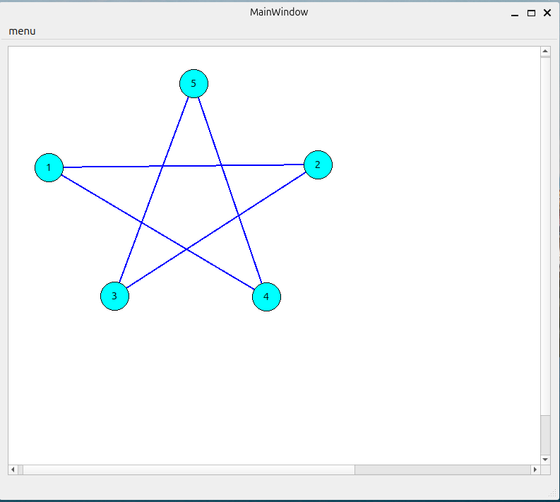

# редактор графов

### Задание

Разработать простейший редактор графов с использованием C++ и QT, где каждым узлом является кружок с порядковым номером создаваемого узла.

---
### Функции
- создание узлов двойным нажатием мыши
- создание ребер между узлами при помощи мыши
- сохранение графа в json формате
- загрузка графа из json формата
---
общий вид программы

демонстрация загрузки графа

---

- Разработано под ubuntu 22.04
- qmake

